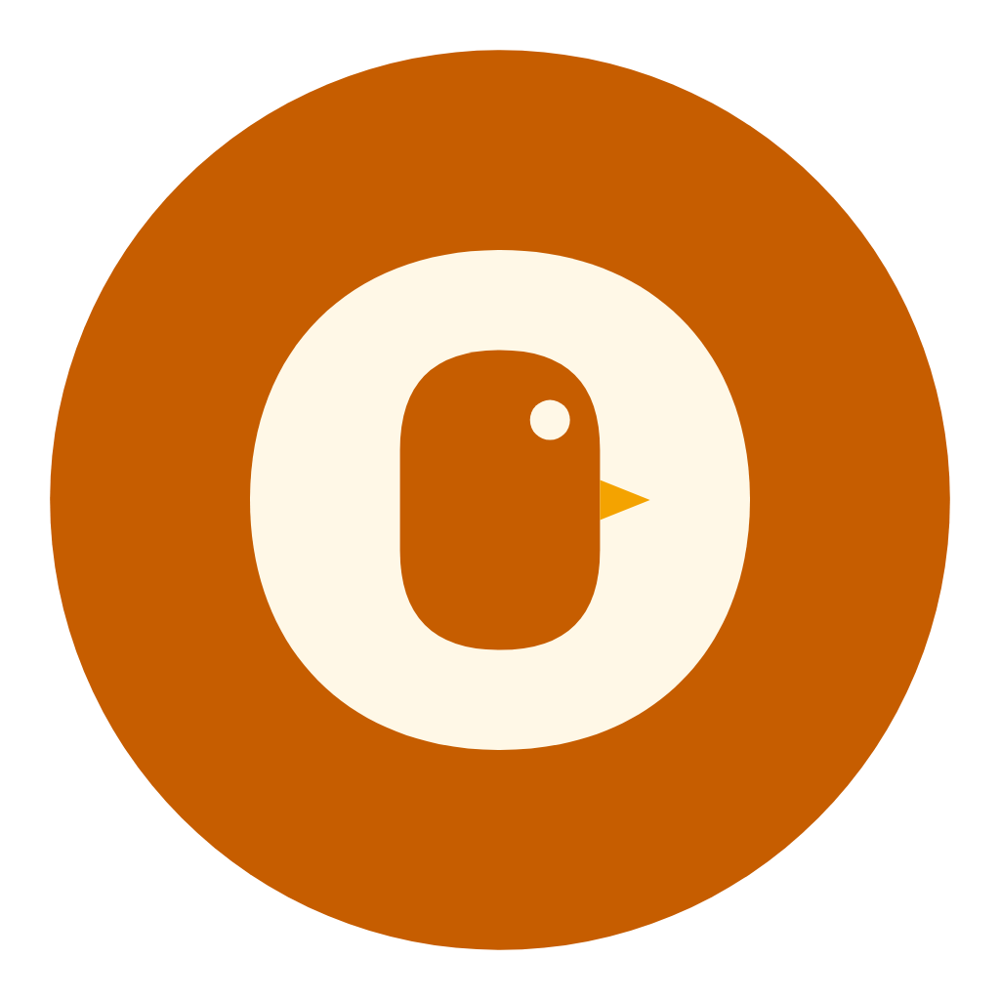

<div align="center">
  
</div>

# KukuMart

**Fresh poultry, straight from the farm to your table.**

KukuMart connects customers with local poultry farmers in East Africa. Browse farms, order fresh chicken, eggs, duck, turkey, and more — delivered to your doorstep.

## Features

- **Browse Products** — Explore fresh poultry and eggs from local farms
- **Farm Profiles** — View farm details, ratings, and product offerings
- **Order Management** — Track orders from confirmation to delivery (customers & farmers)
- **Farmer Dashboard** — Farmers can manage products, view orders, and update statuses
- **Dark Mode** — Full dark theme support
- **Bilingual** — English & Swahili
- **Favorites** — Save your go-to products
- **Address Management** — Save and manage delivery addresses

## Tech Stack

| Layer | Tech |
|-------|------|
| Frontend | React Native (Expo) |
| Backend | Node.js + Express + Prisma |
| Database | PostgreSQL |
| Auth | JWT (access + refresh tokens) |
| State | Zustand |
| i18n | Custom translation system |
| Styling | Custom theme system (Material You-inspired) |

## Getting Started

### Prerequisites

- Node.js 18+
- PostgreSQL
- Expo CLI

### Backend

```bash
cd /path/to/kukubackend
npx tsx src/seed.ts   # Seed the database
npx tsx src/index.ts  # Start API server (port 3000)
```

### Frontend

```bash
cd /path/to/kukumart-app
npm install
npx expo start        # Start Expo dev server (port 8081)
```

### Test Accounts

All passwords: `password123`

| Email | Role |
|-------|------|
| admin@kukumart.com | ADMIN |
| farmer1@farm.com | FARMER (Green Valley Acres) |
| farmer2@farm.com | FARMER (Sunlit Poultry Farm) |
| farmer3@farm.com | FARMER (Safari Poultry & Eggs) |
| farmer4@farm.com | FARMER (Lake View Organic Farm) |
| farmer5@farm.com | FARMER (Highland Kroiler Breeders) |
| user@test.com | CUSTOMER (Alex Kimani) |
| jane@test.com | CUSTOMER (Jane Wanjiku) |

## License

MIT
